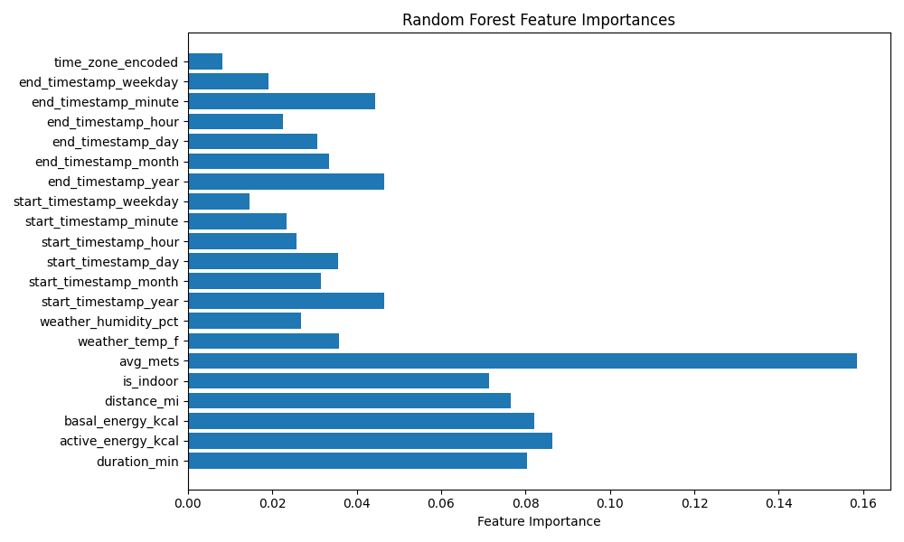
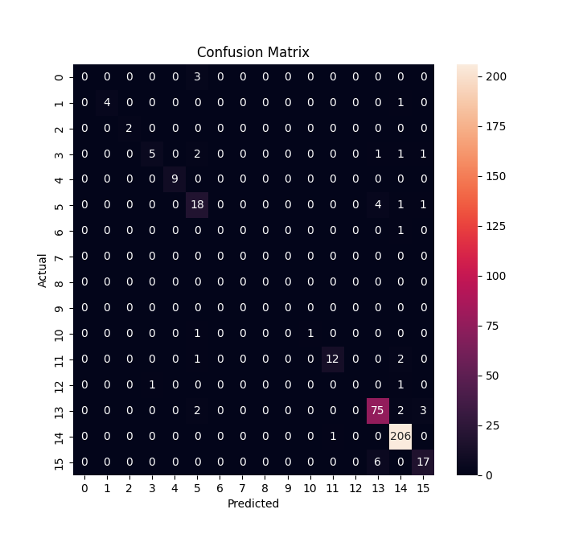

# Predicting Workout Type Using Machine Learning

## Project Overview

This project applies machine learning to personal health data captured by Apple devices (Apple Watch and iPhone) to predict the **type of workout** a user is likely to perform. The goal is to use historical patterns and activity signals (like duration, distance, energy, time of day, etc.) to accurately infer future workout behavior.

##  Objective

Build a supervised machine learning model that can:
- Analyze structured health data extracted from Apple Health XML exports.
- Predict the most probable workout type (e.g., Walking, Yoga, HIIT, etc.).
- Handle class imbalance due to naturally occurring workout frequency bias.

## Technology Stack

- **Language:** Python
- **Model:** Random Forest Classifier (from `scikit-learn`)
- **Data Handling:** Pandas, NumPy
- **Visualization:** Matplotlib, Seaborn
- **Preprocessing:** Label Encoding, Feature Engineering, SMOTE
- **Evaluation:** Confusion Matrix, Classification Report, F1 Score

## Data Pipeline

1. **Extract Health Data**  
   - Stream source XML data from S3

2. **Preprocess & Clean Data**  
   - Convert XML to structured CSV
   - Parse workout and record types
   - Engineer features like duration, distance, METs, is_indoor, timestamps, etc.
   - Store clean CSV in S3

3. **Train-Test Split**  
   - Use stratified split to preserve class distribution
   - Apply SMOTE to oversample minority workout classes

4. **Model Training**  
   - Train Random Forest classifier
   - Apply class weights to handle imbalance
   - Evaluate using macro/micro F1, precision, recall

## Features Used for Prediction

- `duration_min`  
- `active_energy_kcal`, `basal_energy_kcal`  
- `distance_mi`, `is_indoor`  
- `avg_mets`, `weather_temp_f`, `weather_humidity_pct`  
- Timestamps: year, month, day, hour, minute, weekday  
- Encoded time zone and workout type

## Results

- Model achieves strong performance (91% weighted F1-score).
- Majority classes ("Walking, Strength Training") predicted well.
- Minority classes handled using SMOTE and balanced class weights.
- Feature importance shows `avg_mets`, `active_energy_kcal`, and `duration` are most predictive.

## Next Steps

- Experiment with other models (e.g., XGBoost, LightGBM).
- Group rare classes into "Other" for better generalization.
- Build a REST API or Streamlit UI to run predictions in real time.

